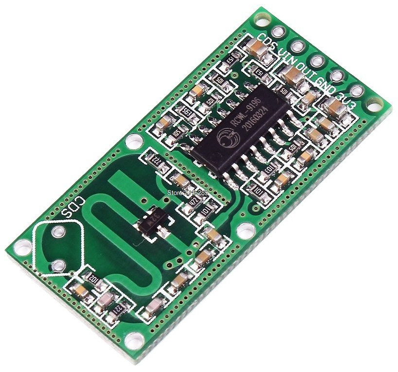
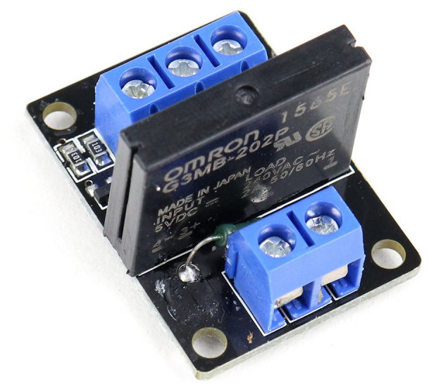
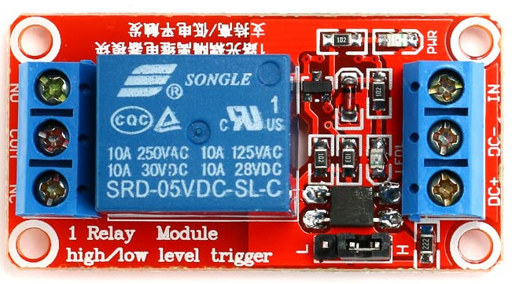
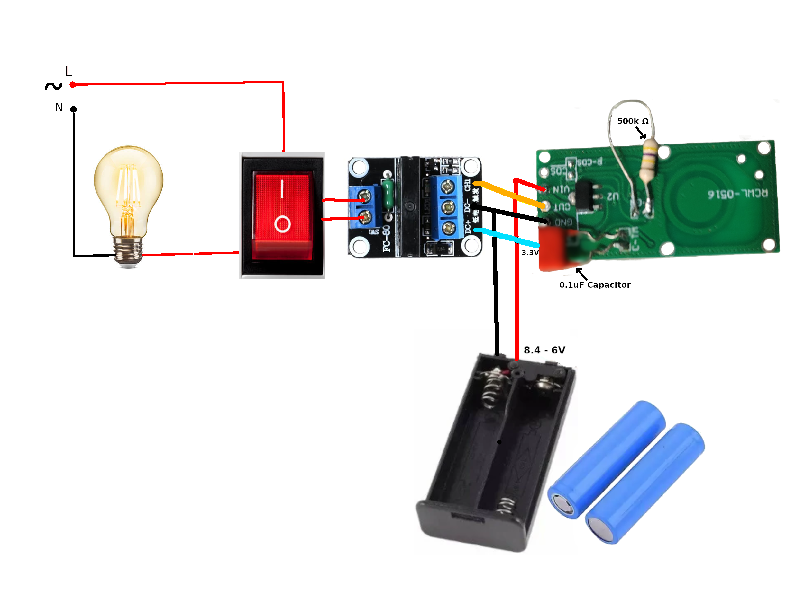
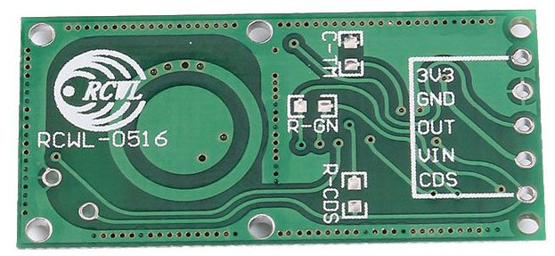
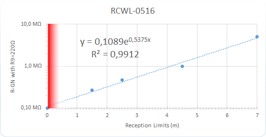

# Motion sensed light

This is a simple implementation to make lights, fans, or other home appliances automatically run in human presence. It is useful in small spaces like balconies and washrooms where lights and fans can be run when a person enters.

The assembly makes a light/fan turn on from two meter distance for >40 seconds when a person enters the area.

## Required components

1. An [RCWL-0516 radar sensor](https://www.amazon.com/HiLetgo-RCWL-0516-Microwave-Sensor-Induction/dp/B082KRTKYC)
  
2. An active high [solid-state relay module](https://www.amazon.com/HiLetgo-Channel-Level-Solid-Module/dp/B00WSN9CJC).

  

  Or an active high [relay module](https://www.amazon.com/dp/B00LW15A4W/) will also do.
  
  

3. A 5v power source or two [18650 batteries](https://www.amazon.com/Yuntunele-Replacement-Battery-Rechargeable-Headlights/dp/B0CSW8525D) with a [holder](https://www.amazon.com/Battery-Storage-2x18650-Batteries-Container/dp/B09C1XFD3B). Also, a charger if you don't have one.
4. 0.1uF capacitor.
5. 500k ohm resistor.

## Assembly

Refer to the following diagram to assemble the components:

Note that the relay is in parallel with the light switch. So if you want the light continuously on, bypassing the motion sensing, then simply turn on the switch.

### Tuning

There are three locations R-GN, C-TM, and CDS on the sensor board that can be used to tweak various aspects of the sensor:

The detection range can be adjusted by soldering a resistor at R-GN location on the sensor module. You can solder 1 mega ohm potentiometer till you get the preferred distance then solder a fixed resistor. Refer to the following diagram to adjust the distance:

Turn-on time can be adjusted by soldering a capacitor at C-TM location on the sensor module. A 0.1uF capacitor keeps the light on for around 35 seconds, and 0.47uF capacitor keeps the light on for around two and a half minutes.

If installed out of the house, then to keep the device off during the day time an [LDR (light-dependent resistor)](https://en.wikipedia.org/wiki/Photoresistor) can be soldered in CDS or R-CDS location.

## Resource

- [How microwave body detectors work. With RF section schematic](https://youtu.be/Hf19hc9PtcE)
- [RCWL-0516 Microwave Radar sensor.pdf](RCWL-0516%20Microwave%20Radar%20Sensor.pdf)
- [RCWL-0516 information](https://github.com/jdesbonnet/RCWL-0516)
